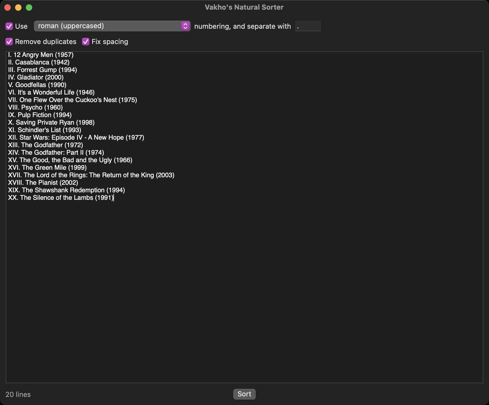

# Vakho's Natural Sorter

## Table of Contents
- [Description](#description)
- [Technologies](#technologies)
- [Setup](#setup)
- [Examples](#examples)
- [Contact](#contact)

## Description
Vakho's Natural Sorter is an open-source utility app for macOS. You can use the app to sort text using a nautral sort order.

#### General Features:
- Sort text using natural sort order, meaning, content of the lines would be read as contextual tokens and not string of characters. For instance, lines "File 2" and "File 11" would be sorted in this order, and not the other way around.

## Technologies
App was developed on macOS 11.0 Big Sur in XCode 12. UI was build using SwiftUI, and no external libraries and frameworks were used.

## Setup
You can simply clone the project and build the app from XCode.

## Examples

## Contact
e-mail: [vakho.kontridze@gmail.com](mailto:vakho.kontridze@gmail.com)
